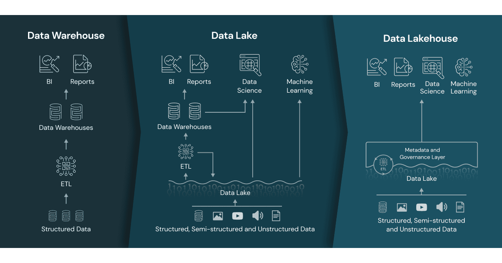

**Data Warehouse vs Data Lake vs Data Lakehouse**

**Data lakehouse = Data Warehouse + Data Lake**

_Key Features:_
*   Transaction support
* Schema enforcement and Governance
* BI Support
* Storage is decoupled from compute
* Openness
* End-to-end streaming

Difference between Hive/Parquet/Delta Lake Tables

DML not supported in Parquet
Delta lake stores data in format of JSON and checkpointed in parquet.

Managed vs External Tables

Optimize data scanning with Partitioning

Data skipping and z-ordering

Deletion Vectors and Liquid clustering

